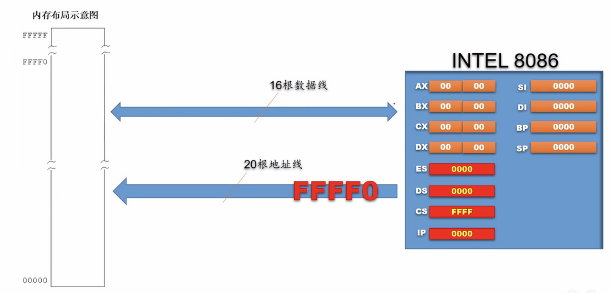
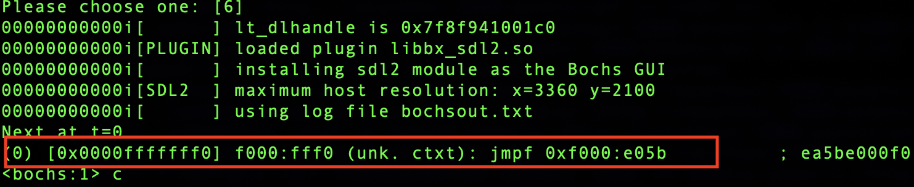

80386之后的CPU开机后，CPU 的CS: IP 寄存器被强制初始化为`0xF000 : 0xFFF0`。

此时 CPU处于实模式  会从`0xFFFF0` 取指令并执行

实模式只能访问1MB 空间(20 位地址线，2^20=1MB = 0xFFFFF) 而地址0xFFFF0 距1MB 只有16 个字节

物理地址0xFFFF0 处的内容是一条跳转指令， `jmp far F000：E05B`, 即跳向了0xFE05B 处，这是BIOS 代码真正开始的地方。

接下来 BIOS 检测内存、显卡等外设信息，当检测通过，并初始化好硬件后，开始在内存中`0x000～0x3FF` 处建立数据结构，中断向量表IVT 并填写中断例程。

BIOS 跳转到0x7c00 是用`jmp 0: 0x7c00` 实现的，这是jmp 指令的直接绝对远转移，CS 会被由之前的0xf000 变成了0。

## 为什么是0x7c00
最早的BIOS是按最小内存32KB 研发的。
MBR 不是随便放在哪里都行的，首先不能覆盖已有的数据，其次，不能过早地被其他数据
8086CPU 要求物理地址0x0～0x3FF 存放中断向量表
按 DOS 1.0 要求的最小内存32KB 来说，MBR 希望给人家尽可能多的预留空间，这样也是保全自己
的作法，免得过早被覆盖。所以MBR 只能放在32KB 的末尾
MBR 虽然本身只有512 字节，但还要为其所用的栈分配点空间，所以其实际所用的内存空间要大于512 字节，估计1KB 内存够用了。
32KB换算为十六进制为0x8000，减去1KB(0x400)的话，等于0x7c00
