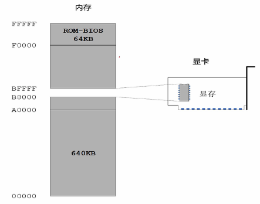
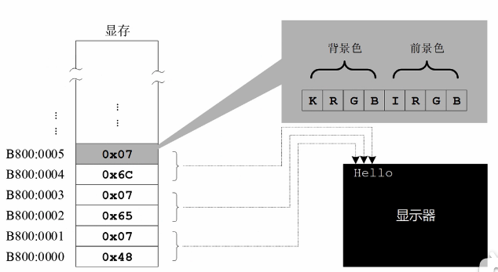
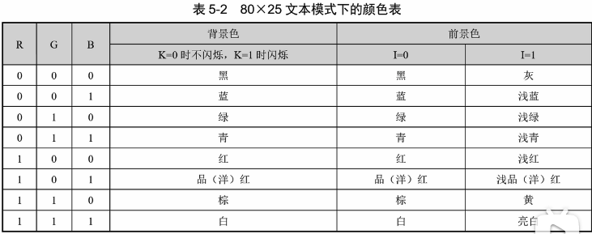

机器缺省进入 80*25 文本显示模式
B800：0000 ~ B800:7FFF





```
  mov ax, 0xb800
  mov ds, ax        ; 不允许直接把立即数赋给段寄存器

  ; set value to ds:0x00
  mov byte [0x00], 0x41         ; A
  mov byte [0x01], 0x04         ; black-red, no flicker
```

